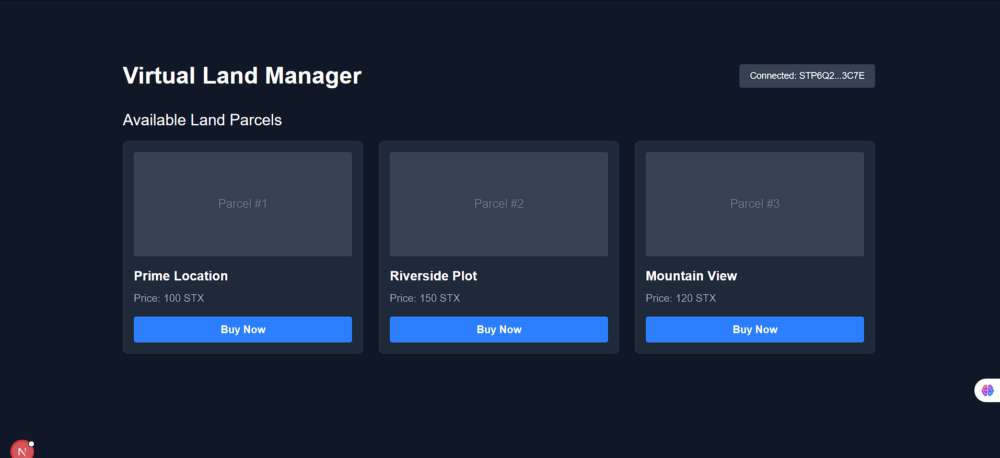
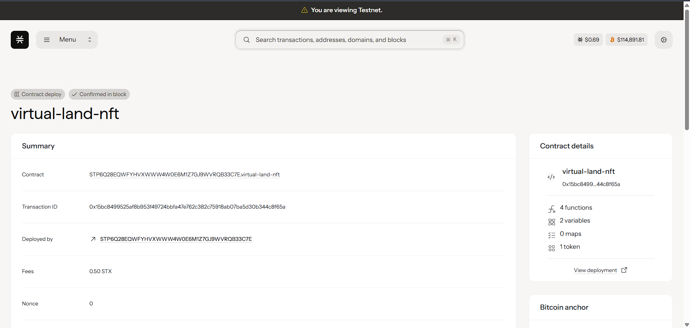
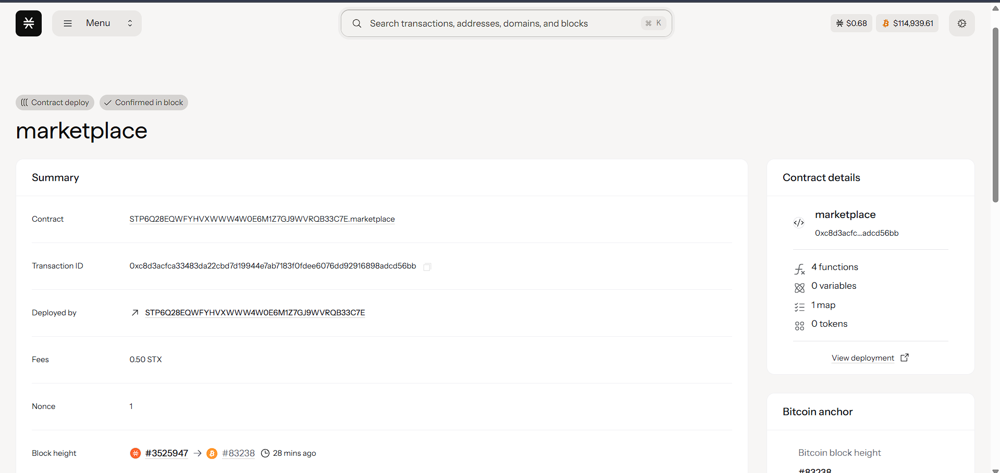

# Virtual Land Manager

A decentralized application (dApp) for buying and selling virtual land parcels as NFTs on the Stacks blockchain. This project was built to demonstrate core concepts of Clarity smart contracts, frontend integration with Stacks.js, and deployment to a live test network.



## Features

* **NFT Representation**: Each land parcel is a unique Non-Fungible Token (NFT) defined in a Clarity smart contract.
* **Decentralized Marketplace**: A marketplace smart contract handles the escrow, listing, and purchasing of land NFTs.
* **Wallet Integration**: Users can connect their Leather (formerly Hiro) wallet to interact with the dApp.
* **Dynamic UI**: The frontend, built with Next.js and React, fetches and displays live data from the deployed smart contracts on the blockchain.

---
## Tech Stack

### Smart Contracts (Backend)
* **[Clarity](https://clarity-lang.org/)**: The smart contract language for the Stacks blockchain.
* **[Clarinet](https://github.com/hirosystems/clarinet)**: The standard tool for local development, testing, and deployment of Clarity contracts.

### Frontend
* **[Next.js](https://nextjs.org/)**: A React framework for building the user interface.
* **[React](https://react.dev/)** & **[TypeScript](https://www.typescriptlang.org/)**: For building robust and scalable UI components.
* **[Tailwind CSS](https://tailwindcss.com/)**: A utility-first CSS framework for styling.
* **[Stacks.js](https://stacks.js.org/)**: The JavaScript library (`@stacks/connect`, `@stacks/network`, `@stacks/transactions`) for connecting the frontend to the Stacks blockchain and user wallets.

---
## Getting Started





### Setup

1.  Clone the repository:
    ```bash
    git clone <https://github.com/aadesh006/Virtual-Land-Manager.git>
    ```
2.  Navigate to the project directory:
    ```bash
    cd virtual-land-manager
    ```
3.  Install frontend dependencies:
    ```bash
    cd frontend
    npm install
    ```
